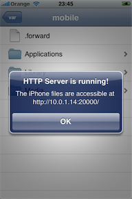
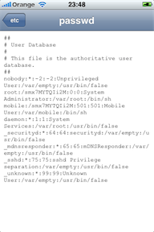
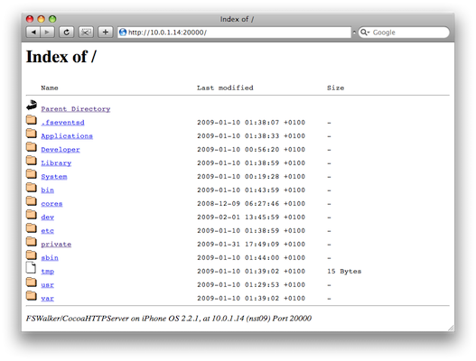

FSWalker
========

_A File System Browser for iOS_

FSWalker lets you browse the iPhone file system, directly on the device or remotely through an embedded web server.

No private API were used. The iPhone does not need to be jailbroken.

An Apple iPhone developer certificate is required to run the application on an actual device.

TODO:

    - files deletion
    - uncripple png files before sending them to http clients
    - improve sound and video support
    - make files downloadable with $ wget -r
    
   
